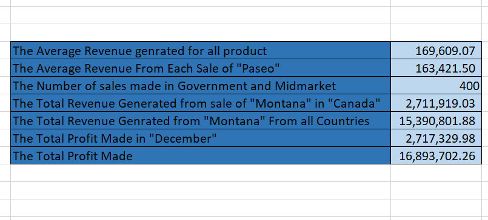
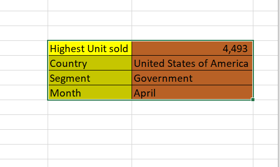

# Financial Records Analysis

## Introduction

In this Excel Task, We were Provided with a Dataset called Financial sales record with 17 columns and 700 rows. The project is gain more insight learn about excel functions and formular and solve some problem.
**_Disclamier_**:_All Dataset do not represent any individual, Institution or company ,but just a dummy set to demonstrate my knowledge of Excel._

## Problem Statement
1. The average revenue generated from each sale of ‘Paseo’
2. The number of sales made in the Government and Midmarket segment
3. The total revenue generated from the sales of ‘Montana’ in Canada
4. What is the total profit made in December?
5. In which Country, Segment and Month was the highest unit of goods sold?

## Skill/ Concepts Documented
	The following are excel features used; 
- excel formular like sumif,Averageif,Xloookup
- Table formatting

  ## Problem Solved
  

  1.	The Average revenue generated from each sale of “Paseo”;
=AVERAGEIF(K2:K701,"Paseo",A2:A701)
The Result is      163,421.50 
While the Average for all Sale of the product      169,609.07 
This shows that majority of the sale is made from the Sale of “Paseo”, Therefore “Paseo” should more prioritize.

2.	The number of sales made in the Government and Midmarket segment;
=SUM(COUNTIF(N2:N701,"Government"),COUNTIF(N2:N701,"Midmarket"))

The Result is 400, The Total No of sale from all segment is 700.
This shows that more than of the sales are from government and Midmarket Segment.

3.	The total revenue generated from the sales of ‘Montana’ in Canada;
=SUMIFS(A2:A701,K2:K701,"Montana",C2:C701,"Canada")
The Result is   2,711,919.03, While the sale “Montana” in all the countries is   15,390,801.88 

4.	The total profit in December:
=SUMIF(I2:I701,"December",L2:L701)
=    2,717,329.98 

 
 1.	The Highest unit sold; =MAX(O2:O701)
=4,493 

The Country which it was sold; =XLOOKUP(T6,O2:O701,C2:C701)
=United State of America

The Segment which it was Sold; =XLOOKUP(T6,O2:O701,N2:N701)
				=Government
The Month which it is Sold; =XLOOKUP(T6,O2:O701,I2:I701)
				       =April

Insight:
 	The company should take note of what was done differently in this month,country and segment i.e United State of America,Government,In April to be able to make that type of sale in other country and segment should apply it for better result.

